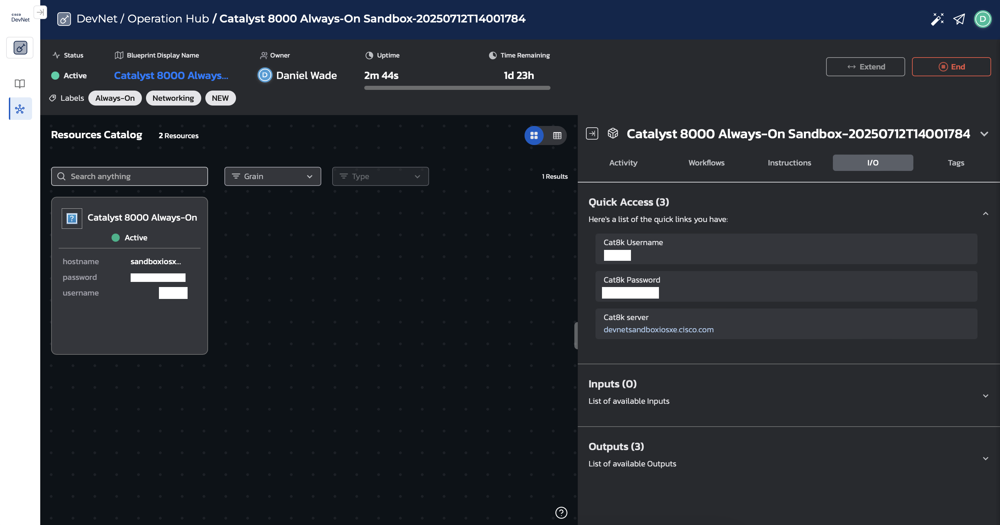

# Exercises for O'Reilly Live Training

> [!IMPORTANT] 
> All exercises in this live training should only be executed in a testing or lab environment. Please do not re-use any of the exercise content in a production network environment.

## Initial Setup

For all the exercises, we are using the Catalyst 8000 Always-On Sandbox provided by [Cisco DevNet Sandboxes](https://devnetsandbox.cisco.com/DevNet). To use the sandboxes, users must login with a GitHub, Cisco ID, Google, or Webex account. Once logged in, reserve the Catalyst 8000 Always-On Sandbox by clicking the 'Launch' button. You'll be prompted to select the 'Duration' of the sandbox. You may leave this as the default value of '2 days'. After clicking 'Review Summary', click on 'Launch Environment' to gain access to the device. The environment should take about 30 seconds to be ready. Once in the sandbox environment, select the 'I/O' tab to view the connection details and login credentials. If you successfully launched the sandbox environment, your screen should look like the screenshot below.

Once you have the connection details and login credentials, be sure to create a `.env` file to ensure they are included in each pyATS testbed file (`testbed.yml`). For convenience, feel free to make a copy of `.env.example` and fill in the values. To load them into your shell, you can use the `load_env_vars.sh` shell script provided or export them individually with the `export` command.

## Live Training Exercises
Below is a breakdown of each section's exercises included in the live training course. For more information, checkout the `README` file included in each section directory.

### November 2025 Live Training - Updates

#### [01-pyats-testscripts](./nov-25/01-pyats-testscripts/)

- Added exercises for testscript parameters and a basic testscript structure

#### [02-exploring-genie](./nov-25/02-exploring-genie/)

- Added exercises for pyATS and Genie CLI
- Added Easypy job that uses gRun to execute Blitz

#### [03-cicd-pipelines](./nov-25/03-cicd-pipelines/)

- Switched to GitHub Actions vs GitLab CI/CD

### July 2025 Live Training

#### [01-pyats-testscripts](./jul-25/01-pyats-testscripts/)

We will explore the pyATS AEtest Test Infrastructure, which is the testing framework that provides the scaffolding to organize, execute, and provide reporting for pyATS testscripts. The AEtest Test Infrastructure is powerful and comes with a suite of testing features/functionality, so we will focus on a couple of the basic constructs: a testscript and jobfile. The testscript contains testcases that include different sections to execute complete tests against a network infrastructure. A jobfile is used to organize and execute multiple testscripts as tasks. The jobfile provides the same runtime environment for all tasks in the job, including sharing the same testbed file and archiving the logs and results together.

#### [02-exploring-genie](./jul-25/02-exploring-genie/)

The Genie CLI provides an intuitive interface to extract data from your network quickly. We will take a look at two Genie commands in particular, `genie parse` and `genie learn`. We will also take a look at how we can use `genie diff` to provide a differential between the configuration and operational state of a network device captured by `genie learn`. This can be a game-changer for identifying differences in network state/configuration before and after network changes.

In addition to exploring the Genie CLI, we will take a look at pyATS Blitz. Blitz provides a low-code, no-code approach to using pyATS and the pyATS library (Genie).

#### [03-cicd-pipelines](./jul-25/03-cicd-pipelines/)

In this exercise, we will review a CI/CD pipeline built in GitLab. It employs multiple network automation tools/libraries, including Ansible, Cisco Modeling Labs (CML) and Cisco pyATS.